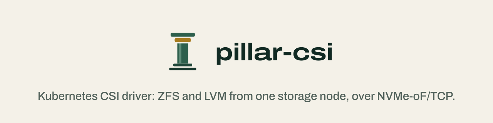
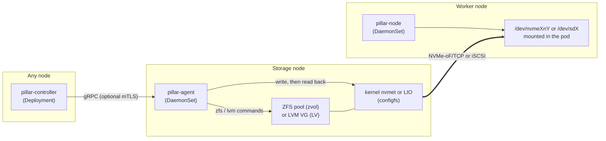

<p align="center">
  <a href="https://pillar-csi.bhyoo.com">
    <picture>
      <source media="(prefers-color-scheme: dark)" srcset="assets/brand/social/readme-banner-dark.svg">
      
    </picture>
  </a>
</p>

# pillar-csi

pillar-csi is one Kubernetes CSI driver for self-hosted and bare-metal clusters. It exports ZFS zvols and LVM volumes over kernel NVMe-oF/TCP or iSCSI.

[](https://github.com/isac322/pillar-csi) [](https://goreportcard.com/report/github.com/isac322/pillar-csi) [](go.mod) [](https://kubernetes.io) [](LICENSE) [](https://github.com/isac322/pillar-csi/releases)

[Website](https://pillar-csi.bhyoo.com) · [Your first PVC](https://pillar-csi.bhyoo.com/docs/tutorials/first-pvc/) · [Documentation](https://pillar-csi.bhyoo.com/docs/) · [Support matrix](https://pillar-csi.bhyoo.com/docs/reference/support-matrix/)

## What it is

You keep a ZFS pool or an LVM volume group on a Linux machine, and pods on other nodes need block volumes from it. pillar-csi carves a zvol or logical volume for each PersistentVolumeClaim, exports it through the kernel NVMe-oF target (nvmet) or the kernel iSCSI target (LIO), and attaches it to the worker with the kernel NVMe/TCP initiator or the kernel iSCSI initiator (`iscsi_tcp`). The pod gets an ext4 or xfs filesystem, or a raw block device.

One driver covers every pool and protocol you configure. You install one Helm release and describe your storage with four cluster-scoped resources. Each backend and protocol keeps the same YAML shape at every level, so a setting you write on a pool looks the same when you override it for one StorageClass or one PVC. NVMe-oF/TCP and iSCSI ship today. NFS and SMB are planned and will plug into the same resources.

pillar-csi does not replicate, stripe, or pool data across nodes. Each volume lives on one storage node, and while that node is down its volumes are unavailable. Protect the data the way you already do on that machine, with ZFS or RAID redundancy and backups.

## Why pillar-csi

Most of what pillar-csi needs ships in its container images. The controller reaches storage nodes through its own agent over gRPC, and nothing logs in over SSH.

| Shipped inside the images | Provided by your hosts |
|---|---|
| Agent: ZFS 2.4 userspace tools and lvm2 | An existing ZFS pool or LVM volume group on the storage node |
| Agent: writes nvmet and LIO (iSCSI target) configfs directly, without `targetcli` or `nvmetcli` | Storage node kernel modules: `nvmet`, `nvmet_tcp` for NVMe-oF; `target_core_mod`, `target_core_iblock`, `iscsi_target_mod` for iSCSI; plus ZFS or device-mapper |
| Node: `util-linux`, `e2fsprogs`, `xfsprogs` for mkfs, mount, and resize | Worker kernel modules: `nvme_tcp`, `nvme_fabrics` for NVMe-oF; `iscsi_tcp` for iSCSI |
| Node: connects through `/dev/nvme-fabrics`, without `nvme-cli`; logs in to iSCSI targets with its own in-process initiator, without `iscsiadm` or `iscsid` | Network reach from workers to the storage node on the NVMe-oF/TCP port (4420 by default) or the iSCSI port (3260 by default) |

The agent reads back each configfs value it writes and returns an error when the kernel reports something different. For iSCSI, pillar-node performs the login itself and hands the connection to the kernel `iscsi_tcp` driver over the `NETLINK_ISCSI` socket, the same interface `iscsid` uses, so hosts need no open-iscsi package. The data path runs from the kernel target on the storage node to the kernel initiator on the worker, with no user-space process in between.

## Support matrix

| Backend | NVMe-oF/TCP | iSCSI | NFS | SMB |
|---|:---:|:---:|:---:|:---:|
| ZFS zvol | Shipped | Shipped | n/a | n/a |
| LVM logical volume (linear or thin) | Shipped | Shipped | n/a | n/a |
| ZFS dataset (planned) | n/a | n/a | Planned | Planned |

Planned items are not available in v0.4.0, and the CRDs reject them. n/a marks combinations that do not apply: block backends are not shared over file protocols, and a dataset is not exported as a block device.

iSCSI covers the same features as NVMe-oF/TCP: both volume modes, `ReadWriteOnce` and `ReadWriteOncePod`, an ACL by initiator IQN (`acl: true`) or an open target (`acl: false`, the default), online expansion, usage stats, local attach, and recovery after agent, node plugin, or storage-node restarts. CHAP authentication and multipath (several portals per target) are not supported.

What works today:

- Access modes `ReadWriteOnce`, `ReadWriteOncePod`, and `ReadOnlyMany`.
- Volume modes `Filesystem` (ext4 or xfs) and `Block`. New filesystems use only on-disk features that Linux 5.15 can mount, so a volume stays mountable on every node it moves to.
- Volume expansion, volume usage stats, and capacity reporting to the scheduler.
- Per-volume tuning of ZFS properties, LVM provisioning mode, NVMe-oF/TCP queue and reconnect settings, iSCSI login, replacement and NOP-Out timeouts, and filesystem options through PVC annotations.
- Optional mTLS between the controller and the agents (off by default).

Not supported yet: `ReadWriteMany` volumes (rejected at provisioning), snapshots, and clones.

## Compared with democratic-csi

democratic-csi is another open-source driver that can export a ZFS zvol from one host to another Kubernetes node over NVMe-oF or iSCSI. It supports more protocols than pillar-csi today. It drives the storage host over SSH with `targetcli` or `nvmetcli`, while pillar-csi runs an agent on the storage node that writes kernel configfs directly.

| | democratic-csi | pillar-csi |
|---|---|---|
| Language | Node.js | Go |
| Deployment | One Helm release per storage backend | One Helm release; each pool is a `PillarStore` resource |
| Reaching the storage node | SSH, running shell commands | gRPC agent on the storage node, with optional mTLS |
| Target configuration | `targetcli` or `nvmetcli` | Direct writes to nvmet or LIO configfs, each read back |
| Worker host packages | `open-iscsi` or `nvme-cli` on every worker | None; kernel modules must be on the host |
| Protocols | iSCSI, NFS, SMB, NVMe-oF | NVMe-oF/TCP and iSCSI (NFS, SMB planned) |

The [comparison page](https://pillar-csi.bhyoo.com/docs/explanation/comparison/) also covers Longhorn and OpenEBS LocalPV.

## How it works



| Workload | Kind | Job |
|---|---|---|
| `pillar-controller` | Deployment | Reconciles the `Pillar*` resources and serves the CSI controller calls: create, delete, expand, publish, unpublish |
| `pillar-agent` | DaemonSet on storage nodes | Creates zvols and LVs, and writes the export to nvmet configfs (NVMe-oF) or LIO configfs (iSCSI) |
| `pillar-node` | DaemonSet on workers | Connects to the target (NVMe-oF through `/dev/nvme-fabrics`, iSCSI through its in-process initiator), formats new volumes, and mounts them for the pod |

The controller labels a node for the agent when you create a `PillarAgent`. Both DaemonSets use the host network, so the NVMe-oF/TCP and iSCSI listeners and connections live in the host network namespace. The iSCSI initiator also needs it: the kernel's `NETLINK_ISCSI` socket exists only in the host network namespace. On nested-container nodes such as Kind, set `node.iscsi.netlinkNetnsPath` instead.

| Resource | Purpose |
|---|---|
| `PillarAgent` | Where a storage agent runs: a cluster node (`nodeRef`) or an external address |
| `PillarStore` | One ZFS pool or LVM volume group on an agent |
| `PillarProtocol` | Transport settings, exactly one member: `nvmeofTcp` (port, ACL, queue size, reconnect timeouts) or `iscsi` (port, ACL, login, replacement and NOP-Out timeouts) |
| `PillarStorageClass` | Binds a store to a protocol and generates a Kubernetes StorageClass |

The controller also keeps an internal `PillarVolumeState` per volume, which records what was provisioned and which nodes the volume is published to. You never write it.

Settings resolve in layers, and each layer uses the same keys. Here a ZFS property is set on the pool, overridden for one StorageClass, and overridden again for one PVC:

```yaml
# PillarStore spec.backend: default for every volume in the pool
zfs: {pool: tank, parentDataset: k8s, properties: {compression: lz4}}

# PillarStorageClass spec.overrides.backend: volumes of this StorageClass
zfs: {properties: {volblocksize: 16K}}

# PVC annotation pillar-csi.bhyoo.com/backend: this volume only
zfs: {properties: {compression: zstd}}
```

The controller resolves the result once, when it creates the volume, and records it so retries reuse the same values. [Volume overrides](https://pillar-csi.bhyoo.com/docs/how-to/volume-overrides/) lists which keys each layer accepts.

Every agent call that changes a volume carries a fencing token made of the volume's lifecycle UID and a generation number. The agent stores the highest token it has applied on the storage node's disk and rejects older ones, so a delayed request from a former controller leader cannot undo newer work. [Fencing and consistency](https://pillar-csi.bhyoo.com/docs/explanation/fencing-and-consistency/) explains the design.

## Quickstart

You need Kubernetes 1.24 or later, a storage node with a ZFS pool or LVM volume group, and the kernel modules from [Why pillar-csi](#why-pillar-csi) on each host. [Prerequisites](https://pillar-csi.bhyoo.com/docs/reference/prerequisites/) has the details, and the [first PVC tutorial](https://pillar-csi.bhyoo.com/docs/tutorials/first-pvc/) starts from a bare disk. The steps below assume the pool already exists.

Tell the agent which pool it serves. Save this as `values.yaml`:

```yaml
agent:
  backends:
    - zfs:
        pool: tank
        parentDataset: k8s
    # or, for LVM:
    # - lvm:
    #     volumeGroup: data-vg
```

`agent.backends` is empty by default, and the agent exits when no backend is configured, so this step is required. Install the chart from the OCI registry:

```sh
helm install pillar-csi oci://ghcr.io/isac322/charts/pillar-csi \
  --version 0.4.0 \
  --namespace pillar-csi --create-namespace \
  -f values.yaml
```

Then describe the storage node, the pool, the protocol, and the StorageClass, and claim a volume. Replace `storage-1` with the name of your storage node:

```yaml
apiVersion: pillar-csi.bhyoo.com/v1alpha1
kind: PillarAgent
metadata:
  name: storage-1
spec:
  nodeRef:
    name: storage-1
---
apiVersion: pillar-csi.bhyoo.com/v1alpha1
kind: PillarStore
metadata:
  name: tank
spec:
  agentRef: storage-1
  backend:
    zfs:
      pool: tank
      parentDataset: k8s   # must match agent.backends
---
apiVersion: pillar-csi.bhyoo.com/v1alpha1
kind: PillarProtocol
metadata:
  name: nvmeof
spec:
  protocol:
    nvmeofTcp:
      port: 4420
      acl: true
# For iSCSI instead:
#   protocol:
#     iscsi:
#       port: 3260
#       acl: true
---
apiVersion: pillar-csi.bhyoo.com/v1alpha1
kind: PillarStorageClass
metadata:
  name: tank-nvmeof
spec:
  storeRef: tank
  protocolRef: nvmeof
  storageClass:
    name: pillar-tank
    volumeBindingMode: WaitForFirstConsumer
---
apiVersion: v1
kind: PersistentVolumeClaim
metadata:
  name: data
  namespace: default
spec:
  accessModes: [ReadWriteOnce]
  storageClassName: pillar-tank
  resources:
    requests:
      storage: 10Gi
```

To encrypt controller-to-agent traffic, see [Configure mTLS](https://pillar-csi.bhyoo.com/docs/how-to/configure-mtls/). Upgrading from 0.2.x requires rewriting your resources and reprovisioning volumes, so read the [upgrade guide](https://pillar-csi.bhyoo.com/docs/how-to/upgrade/) before installing 0.3.0.

Upgrading from 0.3.1, 0.3.2 or 0.3.3 to 0.3.4 is a drop-in `helm upgrade`: no CRD, API or wire changes. 0.3.2 fixes the node plugin wiping the CSINode `spec.drivers` entry when it publishes its NQN annotation on restart ([#128](https://github.com/isac322/pillar-csi/issues/128)). 0.3.3 changes only the license file, which now carries the standard Apache-2.0 text. In 0.3.4, new XFS volumes are formatted with the Linux 5.15 LTS profile so they mount on every supported node kernel ([#133](https://github.com/isac322/pillar-csi/issues/133)); existing volumes are unchanged.

Upgrading from 0.3.x to 0.4.0 is a `helm upgrade`, but it adds the `PillarVolumeReservation` CRD, new `PillarVolumeState` fields (`spec.importedFrom`, `status.importAcquired`) and new agent RPCs, so upgrade the controller, agent and node plugin together in one release. With `installCRDs: true` (the default) the chart applies the new and changed CRDs; if you set `installCRDs: false` and manage CRDs through GitOps, apply the 0.4.0 CRDs (server-side apply) before or with the chart. What 0.4.0 adds:

- Import existing ZFS zvols from other CSI drivers without copying ([Import a zvol](https://pillar-csi.bhyoo.com/docs/how-to/import-zvol/)).
- iSCSI export through the kernel LIO target, with nothing to install on nodes ([Configure iSCSI](https://pillar-csi.bhyoo.com/docs/how-to/configure-iscsi/)).
- Local attach for pods on the storage node (`localAttach: true`, needs `dm_mod`).
- Prometheus metrics and OpenTelemetry traces (`metrics.*`, `tracing.*`).
- mTLS fixes: CSI calls to the agent now use the configured mTLS dialer ([#141](https://github.com/isac322/pillar-csi/issues/141)), and agent probes switch to TCP socket checks when `mtls.enabled=true` so kubelet no longer restarts the agent ([#142](https://github.com/isac322/pillar-csi/issues/142)).

Chart values changes: `metrics.serviceMonitor` is removed (it rendered nothing) and replaced by `metrics.podMonitor` (`enabled`, `interval`, `scrapeTimeout`, `labels`; `additionalLabels` is now `labels`). New values are `metrics.enabled`, `metrics.controller.secure`, `metrics.agent.port`, `metrics.node.port`, `metrics.sidecars.*Port`, `tracing.*` and `node.iscsi.netlinkNetnsPath`. The default `node.initModprobe.modules` adds `dm_mod` and `iscsi_tcp`, and `agent.initModprobe.modules` adds `target_core_mod`, `target_core_iblock` and `iscsi_target_mod`; if you override these lists, add the modules you need.

### Local attach on the storage node

By default a pod scheduled on the storage node reaches its volume over an NVMe-oF/TCP or iSCSI loopback like any other consumer. Set `localAttach: true` on a `PillarStorageClass` (or `pillar-csi.bhyoo.com/local-attach: "true"` on a hand-written StorageClass) to let such pods use the backend zvol or LV directly; pods on other nodes keep using the network protocol. While a volume is attached locally, the network export is disabled for remote initiators, and a publish to another node fails with `FailedPrecondition` until the storage node has released the device. The storage node needs the `dm_mod` kernel module. See [Attach volumes locally on the storage node](https://pillar-csi.bhyoo.com/docs/how-to/local-attach/) and [Fencing and consistency](https://pillar-csi.bhyoo.com/docs/explanation/fencing-and-consistency/).

## Troubleshooting

The pillar-csi resources report their state in status conditions, and each workload logs to its main container:

```sh
kubectl describe pillaragent storage-1          # AgentConnected, Ready
kubectl describe pillarstore tank               # PoolDiscovered, Ready
kubectl describe pillarstorageclass tank-nvmeof # StorageClassCreated, Ready
kubectl describe pvc data                       # provisioning events

kubectl logs -n pillar-csi deploy/pillar-csi-controller -c controller
kubectl logs -n pillar-csi ds/pillar-csi-agent -c agent
kubectl logs -n pillar-csi ds/pillar-csi-node -c node
```

A store whose `parentDataset` or `thinPool` differs from the agent's entry reports `PoolDiscovered=False` with reason `BackendLayoutMismatch`, and provisioning fails instead of placing the volume elsewhere. The [troubleshooting guide](https://pillar-csi.bhyoo.com/docs/how-to/troubleshooting/) covers more cases. Volumes provisioned before `status.exportSpec` existed can stick at `ExportSpecMissing` (issue #83); [Recover a missing export spec](https://pillar-csi.bhyoo.com/docs/how-to/recover-export-spec/) describes the one-time repair.

## Monitoring and tracing

pillar-csi exports Prometheus metrics from the controller, the storage agent and the node plugin, and it can send OpenTelemetry traces to an OTLP/gRPC endpoint such as Grafana Tempo or Jaeger. Metrics show pool capacity, agent health, failing operations and NVMe-oF path state across the fleet. Traces show which step failed for one PVC, and each failure log line carries the `trace_id` of its trace. The controller's metrics endpoint is always on; everything else is off by default:

```sh
helm upgrade pillar-csi oci://ghcr.io/isac322/charts/pillar-csi \
  --namespace pillar-csi \
  -f values.yaml \
  --set metrics.enabled=true \
  --set metrics.podMonitor.enabled=true \
  --set tracing.enabled=true \
  --set tracing.endpoint=http://tempo-distributor.monitoring:4317
```

- `metrics.enabled` serves `/metrics` on the agent and node, and on the CSI provisioner, attacher and resizer sidecars.
- `metrics.podMonitor.enabled` renders prometheus-operator PodMonitors, including the token that the HTTPS controller endpoint requires (`metrics.controller.secure`, on by default).
- `tracing.enabled`, `tracing.endpoint`, `tracing.insecure` and `tracing.samplerRatio` configure the OTLP exporter and the fraction of operations traced.

| component | network | existing ports | metrics ports |
|---|---|---|---|
| agent | hostNetwork | gRPC 9500 | 9501 |
| node | hostNetwork | liveness 9808 | 9502 |
| controller | pod network | health 8081, webhook 9443, liveness 9809 | 8080 (controller), 8090 (provisioner), 8091 (attacher), 8092 (resizer) |

Security notes:

- The agent and node metrics endpoints are plaintext HTTP with no authentication. They listen on the host IP, so anyone who can reach the node can read them. Metrics carry no volume, PV or NQN labels, but they do show pool names and NVMe-oF target addresses. Restrict access with a NetworkPolicy or host firewall if needed.
- The agent's gRPC port is plaintext by default and accepts a W3C `traceparent` from any caller, so a caller can force the agent to record and export spans. Such a caller could already call any agent RPC.

[docs/observability.md](docs/observability.md) has the metric and span reference, TraceQL queries for finding a PVC's traces, example alert rules, and a known limitation: with `mtls.enabled=true`, volume operations fail with `Unavailable` while the agent health check passes.

## Documentation

- [Your first PVC](https://pillar-csi.bhyoo.com/docs/tutorials/first-pvc/)
- [Install with Helm](https://pillar-csi.bhyoo.com/docs/how-to/install-helm/)
- [Prepare a ZFS node](https://pillar-csi.bhyoo.com/docs/how-to/prepare-zfs-node/) and [prepare an LVM node](https://pillar-csi.bhyoo.com/docs/how-to/prepare-lvm-node/)
- [Volume overrides](https://pillar-csi.bhyoo.com/docs/how-to/volume-overrides/) and [PVC annotations](https://pillar-csi.bhyoo.com/docs/reference/annotations/)
- [Tune NVMe-oF](https://pillar-csi.bhyoo.com/docs/how-to/tune-nvmeof/) and [configure iSCSI](https://pillar-csi.bhyoo.com/docs/how-to/configure-iscsi/)
- [Expand a volume](https://pillar-csi.bhyoo.com/docs/how-to/expand-volume/) and [node maintenance](https://pillar-csi.bhyoo.com/docs/how-to/node-maintenance/)
- [CRD reference](https://pillar-csi.bhyoo.com/docs/reference/crd/) and [Helm values](https://pillar-csi.bhyoo.com/docs/reference/helm-values/)
- [Architecture](https://pillar-csi.bhyoo.com/docs/explanation/architecture/)
- [Monitoring and tracing](docs/observability.md)
- [FAQ](https://pillar-csi.bhyoo.com/docs/community/faq/)

## FAQ

### Do I need RDMA network cards?

NVMe-oF/TCP and iSCSI run over ordinary Ethernet. pillar-csi does not implement the RDMA transport.

### What kernel does it need?

For NVMe-oF/TCP the storage node needs `nvmet` and `nvmet_tcp`, and the workers need `nvme_tcp` and `nvme_fabrics`. For iSCSI the storage node needs `target_core_mod`, `target_core_iblock`, and `iscsi_target_mod`, and the workers need `iscsi_tcp`. The pool needs the ZFS or device-mapper modules. The chart runs `modprobe` against the host's `/lib/modules`, so the modules must exist on the host. Check that your kernel ships them before you plan around it.

### Do I need open-iscsi on the workers?

No. pillar-node logs in to iSCSI targets itself and hands the connection to the kernel `iscsi_tcp` driver, so hosts need no `iscsiadm` or `iscsid`. It keeps the initiator IQN in `/etc/iscsi/initiatorname.iscsi` and creates the file when it is missing. If a host already runs `iscsid`, pillar-node leaves that daemon's sessions alone and manages only sessions to pillar-csi targets under its own IQN.

### Can pods on two nodes write to the same volume?

pillar-csi rejects `ReadWriteMany`, and it refuses to publish a `ReadWriteOnce` volume to a second node until the first node unpublishes it. `ReadOnlyMany` volumes can be mounted on several nodes at once.

## Contributing

See [CONTRIBUTING.md](CONTRIBUTING.md) for the development setup and project rules. Report security issues as described in [SECURITY.md](SECURITY.md).

## License

Apache-2.0. See [LICENSE](LICENSE).
