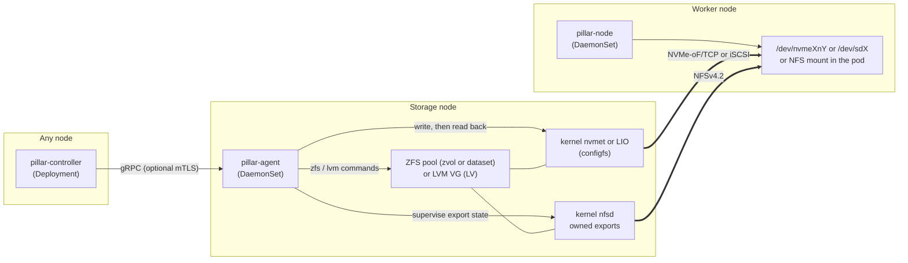

<p align="center">
  <a href="https://pillar-csi.bhyoo.com">
    <picture>
      <source media="(prefers-color-scheme: dark)" srcset="assets/brand/social/readme-banner-dark.svg">
      
    </picture>
  </a>
</p>

# pillar-csi

pillar-csi is one Kubernetes CSI driver for self-hosted and bare-metal clusters. It exports ZFS zvols and LVM volumes over kernel NVMe-oF/TCP or iSCSI, and ZFS datasets as NFSv4.2 filesystems.

[](https://github.com/isac322/pillar-csi) [](https://goreportcard.com/report/github.com/isac322/pillar-csi) [](go.mod) [](https://kubernetes.io) [](LICENSE) [](https://github.com/isac322/pillar-csi/releases)

[Website](https://pillar-csi.bhyoo.com) · [Your first PVC](https://pillar-csi.bhyoo.com/docs/tutorials/first-pvc/) · [Documentation](https://pillar-csi.bhyoo.com/docs/) · [Support matrix](https://pillar-csi.bhyoo.com/docs/reference/support-matrix/)

## What it is

You keep a ZFS pool or an LVM volume group on a Linux machine, and pods on other nodes need volumes from it. pillar-csi carves a zvol or logical volume for block protocols, or creates a ZFS dataset for NFSv4.2. Block volumes use the kernel NVMe-oF target (nvmet) or kernel iSCSI target (LIO); NFS datasets use the kernel NFS server with the bundled mount helper on workers. Block workloads get an ext4 or xfs filesystem, or a raw block device; NFS workloads get a mounted filesystem. The node trims block filesystem volumes weekly, so space freed inside a PVC goes back to a thin zvol or LV without a cron job ([Reclaiming freed space](https://pillar-csi.bhyoo.com/docs/how-to/volume-overrides/#reclaiming-freed-space)).

One driver covers every pool and protocol you configure. You install one Helm release and describe your storage with four cluster-scoped resources. Each backend and protocol keeps the same YAML shape at every level, so a setting you write on a pool looks the same when you override it for one StorageClass or one PVC. NVMe-oF/TCP, iSCSI and NFSv4.2 ship today. SMB remains planned and will use the same resources if added.

pillar-csi does not replicate, stripe, or pool data across nodes. Each volume lives on one storage node, and while that node is down its volumes are unavailable. Protect the data the way you already do on that machine, with ZFS or RAID redundancy and backups.

## Why pillar-csi

Most of what pillar-csi needs ships in its container images. The controller reaches storage nodes through its own agent over gRPC, and nothing logs in over SSH.

| Shipped inside the images | Provided by your hosts |
|---|---|
| Agent: ZFS 2.4 userspace tools and lvm2; creates ZFS datasets and quotas | An existing ZFS pool or LVM volume group on the storage node |
| Agent: writes nvmet and LIO (iSCSI target) configfs directly, and supervises NFS export state without `targetcli`, `nvmetcli` or host `rpc.mountd` setup | Storage node kernel modules: `nvmet`, `nvmet_tcp` for NVMe-oF; `target_core_mod`, `target_core_iblock`, `iscsi_target_mod` for iSCSI; NFS server support; plus ZFS or device-mapper |
| Agent: private NFS export/recovery state and dataset mountpoints | Persistent agent state at `/var/lib/pillar-csi/agent`; its `datasets` pseudoroot must have dedicated NFS-exportable filesystem backing, not container overlay/rootfs |
| Node: `util-linux`, `e2fsprogs`, `xfsprogs` for block mkfs, mount, and resize; bundled NFS client utilities for NFS mounts | Worker kernel modules: `nvme_tcp`, `nvme_fabrics` for NVMe-oF; `iscsi_tcp` for iSCSI; NFS client support |
| Node: connects through `/dev/nvme-fabrics`, without `nvme-cli`; logs in to iSCSI targets with its own in-process initiator, without `iscsiadm` or `iscsid`; mounts NFS with the image-bundled helper | Network reach from workers to the storage node on NVMe-oF/TCP (4420), iSCSI (3260), or NFS (2049) |

The agent reads back each kernel/configuration value it writes and returns an error when the system reports something different. For iSCSI, pillar-node performs login itself and hands the connection to the kernel `iscsi_tcp` driver over `NETLINK_ISCSI`, so hosts need no open-iscsi package. For NFS, the agent owns only the exports it created and reconciles them without stopping or reconfiguring foreign NFS exports. The data path is kernel-backed; user-space helpers run only during connection, mount, export, or recovery operations.

## Support matrix

| Backend | NVMe-oF/TCP | iSCSI | NFS | SMB |
|---|:---:|:---:|:---:|:---:|
| ZFS zvol | Shipped | Shipped | n/a | n/a |
| LVM logical volume (linear or thin) | Shipped | Shipped | n/a | n/a |
| ZFS dataset | n/a | n/a | Shipped | Planned |

SMB is still planned and unavailable; its CRD member is not part of the supported product surface. n/a marks combinations that do not apply: block backends are not shared over file protocols, and a dataset is not exported as a block device.

iSCSI covers the same features as NVMe-oF/TCP: `ReadWriteOnce`, `ReadWriteOncePod`, and `ReadOnlyMany`, an ACL by initiator IQN (`acl: true`) or an open target (`acl: false`, the default), online expansion, usage stats, local attach, and recovery after agent, node plugin, or storage-node restarts. Logins can also be authenticated with CHAP or mutual CHAP, using credentials from a Kubernetes Secret ([Configure iSCSI](https://pillar-csi.bhyoo.com/docs/how-to/configure-iscsi/#authenticate-logins-with-chap)). Multipath (several portals per target) is not supported.

NFS uses only ZFS datasets and supports `Filesystem` with `ReadWriteOnce`, `ReadWriteOncePod`, `ReadOnlyMany`, and `ReadWriteMany`. It uses NFSv4.2 over plain TCP on fixed port 2049, with `root` squash by default; set `squash: none` explicitly when a workload needs root or fsGroup initialization. The node mounts exports onto directories without formatting or block-device bind mounts. `acl: true` restricts volume data access to the published node IPs; an empty ACL denies volume data (an unauthorized mount may still expose an empty backing stub, not the dataset). NFS expands the server-side dataset quota online and reports `NodeExpansionRequired: false`. NFS does not support `localAttach`, block volumes, formatting, or `mkfsOptions`; use `filesystem.mountOptions` for mount flags only. RPC TLS is not offered, so do not treat NFS transport as encryp…

NFS deployment also requires persistent host backing for `/var/lib/pillar-csi/agent/datasets`, the dedicated NFSv4 pseudoroot beneath the chart's `agent-state` hostPath. Keep export/recovery state at `/var/lib/pillar-csi/agent/nfs` persistent, and use the canonical paths without symlinks. NFS server startup rejects a pseudoroot whose backing filesystem cannot encode export filehandles; container overlay/rootfs is not supported backing. The dedicated Kind NFS test fixture mounts a temporary `tmpfs` pseudoroot for QA only. It is not a production storage layout or an automatic fallback; production must retain persistent backing across agent and storage-node restarts. See [prerequisites](https://pillar-csi.bhyoo.com/docs/reference/prerequisites/#nfs-persistent-backing).

What works today:

- Access modes `ReadWriteOnce`, `ReadWriteOncePod`, and `ReadOnlyMany` for block protocols; NFS also supports `ReadWriteMany`.
- Volume modes `Filesystem` (ext4 or xfs for block protocols, NFS for ZFS datasets) and `Block` for NVMe-oF/TCP or iSCSI only.
- Volume expansion, volume usage stats, and capacity reporting to the scheduler. NFS expansion changes the dataset quota and does not resize a client filesystem.
- Per-volume tuning of ZFS properties, LVM provisioning mode, NVMe-oF/TCP queue and reconnect settings, iSCSI login/replacement/NOP-Out timeouts, and filesystem mount options. NFS protocol settings are structural and not per-PVC overrides.
- Optional mTLS between the controller and the agents (off by default). It does not provide RPC or data-plane TLS.
- iSCSI CHAP and mutual CHAP login authentication, with credentials in a Secret in the install namespace.

Not supported yet: SMB, snapshots, and clones. Block protocols reject `ReadWriteMany`; NFS is the only RWX protocol.

LVM adoption and metadata-loss recovery are implemented on the current source revision but are not in a tagged release yet. Adoption keeps the LV and its data by default: deleting the PVC releases the LV, expansion is refused, and the node mounts the existing filesystem without formatting, checking or resizing it. Recovery requires an agent-signed observation, an operator-signed authorization, persistent agent state and verified owner-stop evidence; uncertain ownership fails closed. See [Adopt an existing LVM logical volume](https://pillar-csi.bhyoo.com/docs/how-to/import-lv/) and the [support matrix](https://pillar-csi.bhyoo.com/docs/reference/support-matrix/#adopting-existing-volumes).


## Compared with democratic-csi

democratic-csi is another open-source driver that can export a ZFS zvol from one host to another Kubernetes node over NVMe-oF or iSCSI. It supports more protocols than pillar-csi today. It drives the storage host over SSH with `targetcli` or `nvmetcli`, while pillar-csi runs an agent on the storage node that writes kernel configfs directly.

| | democratic-csi | pillar-csi |
|---|---|---|
| Language | Node.js | Go |
| Deployment | One Helm release per storage backend | One Helm release; each pool is a `PillarStore` resource |
| Reaching the storage node | SSH, running shell commands | gRPC agent on the storage node, with optional mTLS |
| Target configuration | `targetcli` or `nvmetcli` | Direct writes to nvmet or LIO configfs, each read back |
| Worker host packages | `open-iscsi` or `nvme-cli` on every worker | None; kernel modules must be on the host |
| Protocols | iSCSI, NFS, SMB, NVMe-oF | NVMe-oF/TCP, iSCSI and NFSv4.2 (SMB planned) |

The [comparison page](https://pillar-csi.bhyoo.com/docs/explanation/comparison/) also covers Longhorn and OpenEBS LocalPV.

## How it works


| Workload | Kind | Job |
|---|---|---|
| `pillar-controller` | Deployment | Reconciles the `Pillar*` resources and serves the CSI controller calls: create, delete, expand, publish, unpublish |
| `pillar-agent` | DaemonSet on storage nodes | Creates zvols/LVs or ZFS datasets, and writes NVMe-oF/LIO exports or reconciles owned NFS exports |
| `pillar-node` | DaemonSet on workers | Connects to block targets or mounts NFS with bundled utilities, formats only blank block volumes, mounts them for the pod, and periodically trims mounted block filesystems |

The controller labels a node for the agent when you create a `PillarAgent`. Both DaemonSets use the host network, so the NVMe-oF/TCP and iSCSI listeners and connections live in the host network namespace. The iSCSI initiator also needs it: the kernel's `NETLINK_ISCSI` socket exists only in the host network namespace. On nested-container nodes such as Kind, set `node.iscsi.netlinkNetnsPath` instead.

| Resource | Purpose |
|---|---|
| `PillarAgent` | Where a storage agent runs: a cluster node (`nodeRef`) or an external address |
| `PillarStore` | One ZFS pool, ZFS dataset parent, or LVM volume group on an agent |
| `PillarProtocol` | Transport settings, exactly one member: `nvmeofTcp`, `iscsi`, or `nfs` (`version`, fixed `port`, ACL, and squash policy) |
| `PillarStorageClass` | Binds a store to a protocol and generates a Kubernetes StorageClass |

The controller also keeps an internal `PillarVolumeState` per volume, which records what was provisioned and which nodes the volume is published to. You never write it.

Settings resolve in layers, and each layer uses the same keys. Here a ZFS property is set on the pool, overridden for one StorageClass, and overridden again for one PVC:

```yaml
# PillarStore spec.backend: default for every volume in the pool
zfs: {pool: tank, parentDataset: k8s, properties: {compression: lz4}}

# PillarStorageClass spec.overrides.backend: volumes of this StorageClass
zfs: {properties: {volblocksize: 16K}}

# PVC annotation pillar-csi.bhyoo.com/backend: this volume only
zfs: {properties: {compression: zstd}}
```

The controller resolves the result once, when it creates the volume, and records it so retries reuse the same values. [Volume overrides](https://pillar-csi.bhyoo.com/docs/how-to/volume-overrides/) lists which keys each layer accepts.

Every agent call that changes a volume carries a fencing token made of the volume's lifecycle UID and a generation number. The agent stores the highest token it has applied on the storage node's disk and rejects older ones, so a delayed request from a former controller leader cannot undo newer work. [Fencing and consistency](https://pillar-csi.bhyoo.com/docs/explanation/fencing-and-consistency/) explains the design.

## Quickstart

You need Kubernetes 1.24 or later, a storage node with a ZFS pool or LVM volume group, and the kernel modules from [Why pillar-csi](#why-pillar-csi) on each host. [Prerequisites](https://pillar-csi.bhyoo.com/docs/reference/prerequisites/) has the details, and the [first PVC tutorial](https://pillar-csi.bhyoo.com/docs/tutorials/first-pvc/) starts from a bare disk. The steps below assume the pool already exists.

Tell the agent which pool it serves. Save this as `values.yaml`:

```yaml
agent:
  backends:
    - zfs:
        volumeType: zvol
        pool: tank
        parentDataset: k8s
    # To offer NFS datasets from the same pool, add a second backend entry:
    # - zfs:
    #     volumeType: dataset
    #     pool: tank
    #     parentDataset: k8s
    # Or, for LVM:
    # - lvm:
    #     volumeGroup: data-vg
```

`agent.backends` is empty by default, and the agent exits when no backend is configured, so this step is required. Install the chart from the OCI registry:

```sh
helm install pillar-csi oci://ghcr.io/isac322/charts/pillar-csi \
  --version 0.5.3 \
  --namespace pillar-csi --create-namespace \
  -f values.yaml
```

Then describe the storage node, the pool, the protocol, and the StorageClass, and claim a volume. Replace `storage-1` with the name of your storage node:

```yaml
apiVersion: pillar-csi.bhyoo.com/v1alpha1
kind: PillarAgent
metadata:
  name: storage-1
spec:
  nodeRef:
    name: storage-1
---
apiVersion: pillar-csi.bhyoo.com/v1alpha1
kind: PillarStore
metadata:
  name: tank
spec:
  agentRef: storage-1
  backend:
    zfs:
      pool: tank
      parentDataset: k8s   # must match agent.backends
---
apiVersion: pillar-csi.bhyoo.com/v1alpha1
kind: PillarProtocol
metadata:
  name: nvmeof
spec:
  protocol:
    nvmeofTcp:
      port: 4420
      acl: true
# For iSCSI instead:
#   protocol:
#     iscsi:
#       port: 3260
#       acl: true
---
apiVersion: pillar-csi.bhyoo.com/v1alpha1
kind: PillarStorageClass
metadata:
  name: tank-nvmeof
spec:
  storeRef: tank
  protocolRef: nvmeof
  storageClass:
    name: pillar-tank
    volumeBindingMode: WaitForFirstConsumer
---
apiVersion: v1
kind: PersistentVolumeClaim
metadata:
  name: data
  namespace: default
spec:
  accessModes: [ReadWriteOnce]
  storageClassName: pillar-tank
  resources:
    requests:
      storage: 10Gi
```

For a shared filesystem volume, use a ZFS dataset with NFSv4.2. The protocol keeps its fixed port and structural settings; only `filesystem.mountOptions` are mount flags:

```yaml
apiVersion: pillar-csi.bhyoo.com/v1alpha1
kind: PillarStore
metadata:
  name: tank-datasets
spec:
  agentRef: storage-1
  backend:
    zfs:
      volumeType: dataset
      pool: tank
      parentDataset: k8s
---
apiVersion: pillar-csi.bhyoo.com/v1alpha1
kind: PillarProtocol
metadata:
  name: nfs42
spec:
  protocol:
    nfs:
      version: "4.2"
      port: 2049
      acl: true
      squash: root
---
apiVersion: pillar-csi.bhyoo.com/v1alpha1
kind: PillarStorageClass
metadata:
  name: tank-nfs
spec:
  storeRef: tank-datasets
  protocolRef: nfs42
  filesystem:
    mountOptions: ["timeo=600"]
  storageClass:
    name: pillar-tank-nfs
    allowVolumeExpansion: true
---
apiVersion: v1
kind: PersistentVolumeClaim
metadata:
  name: shared-data
spec:
  accessModes: [ReadWriteMany]
  storageClassName: pillar-tank-nfs
  resources:
    requests:
      storage: 10Gi
```

Use `squash: none` explicitly only when the workload requires root or fsGroup initialization on the export. `localAttach`, `mkfsOptions`, explicit ext4/xfs, periodic trim, and block volume mode are invalid for NFS.

To encrypt controller-to-agent traffic, see [Configure mTLS](https://pillar-csi.bhyoo.com/docs/how-to/configure-mtls/). Upgrading from 0.2.x requires rewriting your resources and reprovisioning volumes, so read the [upgrade guide](https://pillar-csi.bhyoo.com/docs/how-to/upgrade/) before installing 0.3.0.

Upgrading from 0.3.1, 0.3.2 or 0.3.3 to 0.3.4 is a drop-in `helm upgrade`: no CRD, API or wire changes. 0.3.2 fixes the node plugin wiping the CSINode `spec.drivers` entry when it publishes its NQN annotation on restart ([#128](https://github.com/isac322/pillar-csi/issues/128)). 0.3.3 changes only the license file, which now carries the standard Apache-2.0 text. In 0.3.4, new XFS volumes are formatted with the Linux 5.15 LTS profile so they mount on every supported node kernel ([#133](https://github.com/isac322/pillar-csi/issues/133)); existing volumes are unchanged.

Upgrading from 0.3.x to 0.4.0 is a `helm upgrade`, but it adds the `PillarVolumeReservation` CRD, new `PillarVolumeState` fields (`spec.importedFrom`, `status.importAcquired`) and new agent RPCs, so upgrade the controller, agent and node plugin together in one release. With `installCRDs: true` (the default) the chart applies the new and changed CRDs; if you set `installCRDs: false` and manage CRDs through GitOps, apply the 0.4.0 CRDs (server-side apply) before or with the chart. What 0.4.0 adds:

- Import existing ZFS zvols from other CSI drivers without copying ([Import a zvol](https://pillar-csi.bhyoo.com/docs/how-to/import-zvol/)).
- iSCSI export through the kernel LIO target, with nothing to install on nodes ([Configure iSCSI](https://pillar-csi.bhyoo.com/docs/how-to/configure-iscsi/)).
- Local attach for pods on the storage node (`localAttach: true`, needs `dm_mod`).
- Prometheus metrics and OpenTelemetry traces (`metrics.*`, `tracing.*`).
- mTLS fixes: CSI calls to the agent now use the configured mTLS dialer ([#141](https://github.com/isac322/pillar-csi/issues/141)), and agent probes switch to TCP socket checks when `mtls.enabled=true` so kubelet no longer restarts the agent ([#142](https://github.com/isac322/pillar-csi/issues/142)).

Chart values changes: `metrics.serviceMonitor` is removed (it rendered nothing) and replaced by `metrics.podMonitor` (`enabled`, `interval`, `scrapeTimeout`, `labels`; `additionalLabels` is now `labels`). New values are `metrics.enabled`, `metrics.controller.secure`, `metrics.agent.port`, `metrics.node.port`, `metrics.sidecars.*Port`, `tracing.*` and `node.iscsi.netlinkNetnsPath`. The default `node.initModprobe.modules` adds `dm_mod` and `iscsi_tcp`, and `agent.initModprobe.modules` adds `target_core_mod`, `target_core_iblock` and `iscsi_target_mod`; if you override these lists, add the modules you need.

Upgrading from 0.4.x to 0.5.0 is a `helm upgrade`, but it adds CRD fields (`spec.protocol.iscsi.auth` on `PillarProtocol`, `nvmeofTcp.maxDataTransferSize` on `PillarProtocol` and on `PillarStorageClass` and PVC override documents) and new agent RPC fields, so upgrade the controller, agent and node plugin together in one release. With `installCRDs: true` (the default) the chart applies the changed CRDs; if you set `installCRDs: false` and manage CRDs through GitOps, apply the 0.5.0 CRDs (server-side apply) before or with the chart. What 0.5.0 adds:

- iSCSI CHAP and mutual CHAP login authentication, with the credentials in a Secret in the install namespace ([Configure iSCSI](https://pillar-csi.bhyoo.com/docs/how-to/configure-iscsi/#authenticate-logins-with-chap)).
- A per-command data size limit (MDTS) for NVMe-oF/TCP, `nvmeofTcp.maxDataTransferSize`, defaulting to 4 MiB, which stops write failures on targets whose memory is too fragmented for large scatterlist allocations ([Tune NVMe-oF/TCP settings](https://pillar-csi.bhyoo.com/docs/how-to/tune-nvmeof/#maximum-data-transfer-size)). Existing NVMe-oF/TCP volumes get the 4 MiB client-side cap automatically after the node plugin restarts when the target kernel lacks `param_mdts` (Linux older than 7.1); no other action is needed.
- Periodic filesystem trim of staged volumes, so blocks freed inside a PVC return to the thin zvol or LV ([Reclaiming freed space](https://pillar-csi.bhyoo.com/docs/how-to/volume-overrides/#reclaiming-freed-space)).
- A bug fix: `csi.storage.k8s.io/fstype: xfs` on a hand-written StorageClass now produces an XFS volume instead of ext4.

Chart values changes: new `node.trim.enabled` and `node.trim.interval`. With `rbac.create: true` (the default) the chart also adds a namespaced Role and RoleBinding so the controller can read the Secrets named by `iscsi.auth.secretRef`.

Upgrading from 0.5.0 to 0.5.1 is a `helm upgrade`, but it adds CRD fields (`spec.protocol.nfs` on `PillarProtocol` and `PillarStorageClass`, the `nfs` protocol and `dataset` volumeType members) and new agent RPC fields, so upgrade the controller, agent and node plugin together in one release. With `installCRDs: true` (the default) the chart applies the changed CRDs; if you set `installCRDs: false` and manage CRDs through GitOps, apply the 0.5.1 CRDs (server-side apply) before or with the chart. What 0.5.1 adds:

- Shared NFSv4.2 volumes on ZFS datasets, including `ReadWriteMany`: the agent runs the kernel NFS server and reconciles only its own exports, and the node mounts with the bundled helper, so hosts need no NFS packages ([Configure NFS](https://pillar-csi.bhyoo.com/docs/how-to/configure-nfs/)).
- A bug fix: a staged filesystem that entered kernel shutdown (an XFS shutdown or an ext4 remount-ro abort) still passed the mount-table check, so NodeStageVolume reported success forever while pod bind mounts failed ([#168](https://github.com/isac322/pillar-csi/issues/168)); the node plugin now probes the staged filesystem and re-mounts a dead one.

Chart values changes: the default `node.initModprobe.modules` adds `nfs` and `nfsv4`; if you override that list, add the modules you need. ZFS `agent.backends` entries accept `volumeType: dataset` with `parentDataset`, and dataset placement enables the NFS server deployment contract.

Upgrading from 0.5.1 to 0.5.2 is a `helm upgrade` with no CRD changes; only the node plugin image changed. What 0.5.2 adds:

- A bug fix: kubelet retries NodePublishVolume without ever re-calling NodeStageVolume while the VolumeAttachment persists, so the 0.5.1 staged-filesystem repair could never run during pod-delete — the pod stayed ContainerCreating with `mount` exit 32 until an operator detached the volume ([#172](https://github.com/isac322/pillar-csi/issues/172)); NodePublishVolume now probes the staged mount before bind-mounting and repairs a dead one in place (unmount + re-mount replays the journal) when nothing else pins it.
- A bug fix (follow-up to [#168](https://github.com/isac322/pillar-csi/issues/168)): a volume published to two pod bind targets could be downgraded to `NodeStaged` after the first NodeUnpublishVolume while a bind still pinned it; the node plugin now keeps the volume `NodePublished` until the last bind is unpublished.

Upgrading from 0.5.2 to 0.5.3 is a `helm upgrade` with no CRD or values changes; only the node plugin changed. What 0.5.3 adds:

- A bug fix: on a staged filesystem in kernel shutdown, `stat(2)` on the mount point fails with EIO while the mount stays listed, and the 0.5.2 publish repair checked the mount with `stat` first — so every kubelet retry failed with `IsLikelyNotMountPoint ... input/output error` and the pod stayed ContainerCreating until the volume was detached ([#175](https://github.com/isac322/pillar-csi/issues/175)). The node plugin now decides whether a path is mounted from the kernel mount table, so the dead staged mount is repaired in place as soon as no pod bind pins it; read-only, NFS and raw block mounts that skip the write probe are checked with a non-writing probe and are still never reported healthy while dead.

### Local attach on the storage node

By default a pod scheduled on the storage node reaches a block volume over an NVMe-oF/TCP or iSCSI loopback like any other consumer. Set `localAttach: true` on a `PillarStorageClass` (or `pillar-csi.bhyoo.com/local-attach: "true"` on a hand-written StorageClass) to let such pods use a block backend zvol or LV directly; NFS volumes reject `localAttach` and always use their NFS network mount, including on the storage node. Pods on other nodes keep using the network protocol. While a block volume is attached locally, the network export is disabled for remote initiators, and a publish to another node fails with `FailedPrecondition` until the storage node has released the device. The storage node needs the `dm_mod` kernel module. See [Attach volumes locally on the storage node](https://pillar-csi.bhyoo.com/docs/how-to/local-attach/) and [Fencing and consistency](https://pillar-csi.bhyoo.com/docs/explanation/fencing-and-consistency/).

## Troubleshooting

The pillar-csi resources report their state in status conditions, and each workload logs to its main container:

```sh
kubectl describe pillaragent storage-1          # AgentConnected, Ready
kubectl describe pillarstore tank               # PoolDiscovered, Ready
kubectl describe pillarstorageclass tank-nvmeof # StorageClassCreated, Ready
kubectl describe pvc data                       # provisioning events

kubectl logs -n pillar-csi deploy/pillar-csi-controller -c controller
kubectl logs -n pillar-csi ds/pillar-csi-agent -c agent
kubectl logs -n pillar-csi ds/pillar-csi-node -c node
```

A store whose `parentDataset` or `thinPool` differs from the agent's entry reports `PoolDiscovered=False` with reason `BackendLayoutMismatch`, and provisioning fails instead of placing the volume elsewhere. The [troubleshooting guide](https://pillar-csi.bhyoo.com/docs/how-to/troubleshooting/) covers more cases. Volumes provisioned before `status.exportSpec` existed can stick at `ExportSpecMissing` (issue #83); [Recover a missing export spec](https://pillar-csi.bhyoo.com/docs/how-to/recover-export-spec/) describes the one-time repair.

## Monitoring and tracing

pillar-csi exports Prometheus metrics from the controller, the storage agent and the node plugin, and it can send OpenTelemetry traces to an OTLP/gRPC endpoint such as Grafana Tempo or Jaeger. Metrics show pool capacity, agent health, failing operations and NVMe-oF path state across the fleet. Traces show which step failed for one PVC, and each failure log line carries the `trace_id` of its trace. The controller's metrics endpoint is always on; everything else is off by default:

```sh
helm upgrade pillar-csi oci://ghcr.io/isac322/charts/pillar-csi \
  --namespace pillar-csi \
  -f values.yaml \
  --set metrics.enabled=true \
  --set metrics.podMonitor.enabled=true \
  --set tracing.enabled=true \
  --set tracing.endpoint=http://tempo-distributor.monitoring:4317
```

- `metrics.enabled` serves `/metrics` on the agent and node, and on the CSI provisioner, attacher and resizer sidecars.
- `metrics.podMonitor.enabled` renders prometheus-operator PodMonitors, including the token that the HTTPS controller endpoint requires (`metrics.controller.secure`, on by default).
- `tracing.enabled`, `tracing.endpoint`, `tracing.insecure` and `tracing.samplerRatio` configure the OTLP exporter and the fraction of operations traced.

| component | network | existing ports | metrics ports |
|---|---|---|---|
| agent | hostNetwork | gRPC 9500 | 9501 |
| node | hostNetwork | liveness 9808 | 9502 |
| controller | pod network | health 8081, webhook 9443, liveness 9809 | 8080 (controller), 8090 (provisioner), 8091 (attacher), 8092 (resizer) |

Security notes:

- The agent and node metrics endpoints are plaintext HTTP with no authentication. They listen on the host IP, so anyone who can reach the node can read them. Metrics carry no volume, PV or NQN labels, but they do show pool names and NVMe-oF target addresses. Restrict access with a NetworkPolicy or host firewall if needed.
- The agent's gRPC port is plaintext by default and accepts a W3C `traceparent` from any caller, so a caller can force the agent to record and export spans. Such a caller could already call any agent RPC.

[docs/observability.md](docs/observability.md) has the metric and span reference, TraceQL queries for finding a PVC's traces, example alert rules, and a known limitation: with `mtls.enabled=true`, volume operations fail with `Unavailable` while the agent health check passes.

## Documentation

- [Your first PVC](https://pillar-csi.bhyoo.com/docs/tutorials/first-pvc/)
- [Install with Helm](https://pillar-csi.bhyoo.com/docs/how-to/install-helm/)
- [Prepare a ZFS node](https://pillar-csi.bhyoo.com/docs/how-to/prepare-zfs-node/) and [prepare an LVM node](https://pillar-csi.bhyoo.com/docs/how-to/prepare-lvm-node/)
- [Volume overrides](https://pillar-csi.bhyoo.com/docs/how-to/volume-overrides/) and [PVC annotations](https://pillar-csi.bhyoo.com/docs/reference/annotations/)
- [Import a zvol](https://pillar-csi.bhyoo.com/docs/how-to/import-zvol/) and [adopt an existing LVM logical volume](https://pillar-csi.bhyoo.com/docs/how-to/import-lv/) (LV adoption is not in a release yet)
- [Tune NVMe-oF](https://pillar-csi.bhyoo.com/docs/how-to/tune-nvmeof/) and [configure iSCSI](https://pillar-csi.bhyoo.com/docs/how-to/configure-iscsi/)
- [Expand a volume](https://pillar-csi.bhyoo.com/docs/how-to/expand-volume/) and [node maintenance](https://pillar-csi.bhyoo.com/docs/how-to/node-maintenance/)
- [CRD reference](https://pillar-csi.bhyoo.com/docs/reference/crd/) and [Helm values](https://pillar-csi.bhyoo.com/docs/reference/helm-values/)
- [Architecture](https://pillar-csi.bhyoo.com/docs/explanation/architecture/)
- [Monitoring and tracing](docs/observability.md)
- [FAQ](https://pillar-csi.bhyoo.com/docs/community/faq/)

## FAQ

### Do I need RDMA network cards?

NVMe-oF/TCP and iSCSI run over ordinary Ethernet. pillar-csi does not implement the RDMA transport.

### What kernel does it need?

For NVMe-oF/TCP the storage node needs `nvmet` and `nvmet_tcp`, and the workers need `nvme_tcp` and `nvme_fabrics`. For iSCSI the storage node needs `target_core_mod`, `target_core_iblock`, and `iscsi_target_mod`, and the workers need `iscsi_tcp`. The pool needs the ZFS or device-mapper modules. The chart runs `modprobe` against the host's `/lib/modules`, so the modules must exist on the host. Check that your kernel ships them before you plan around it.

### Do I need open-iscsi on the workers?

No. pillar-node logs in to iSCSI targets itself and hands the connection to the kernel `iscsi_tcp` driver, so hosts need no `iscsiadm` or `iscsid`. It keeps the initiator IQN in `/etc/iscsi/initiatorname.iscsi` and creates the file when it is missing. If a host already runs `iscsid`, pillar-node leaves that daemon's sessions alone and manages only sessions to pillar-csi targets under its own IQN.

### Can pods on two nodes write to the same volume?

pillar-csi rejects `ReadWriteMany`, and it refuses to publish a `ReadWriteOnce` volume to a second node until the first node unpublishes it. `ReadOnlyMany` volumes can be mounted on several nodes at once.

## Contributing

See [CONTRIBUTING.md](CONTRIBUTING.md) for the development setup and project rules. Report security issues as described in [SECURITY.md](SECURITY.md).

## License

Apache-2.0. See [LICENSE](LICENSE).
